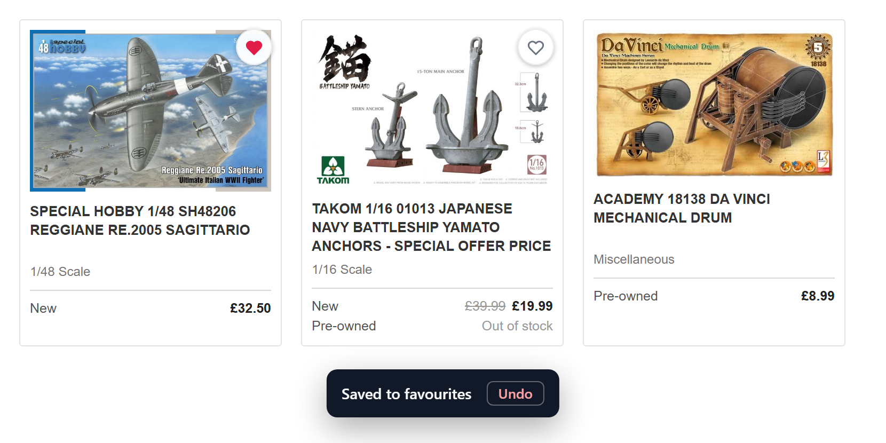
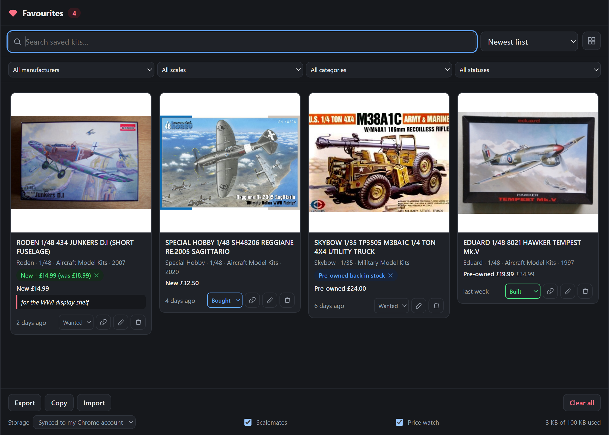

# KingKit Favourites

A Chrome extension that adds a "save for later" list to [kingkit.co.uk](https://www.kingkit.co.uk), which has no
built-in favouriting. Hover any product image, click the heart, and the kit is saved — with its title, thumbnail,
scale, and both the new and pre-owned prices — to a list you can search, annotate and manage from the toolbar.

Nothing is sent anywhere. Favourites live in Chrome's own storage and, by default, sync to any Chrome you are
signed into with the same Google account.



## Features

**On the KingKit site**

- **A heart on every product image.** It stays invisible until you hover the tile, so browsing looks unchanged —
  but once an item is saved the heart stays filled and visible, making it obvious at a glance which kits in a set
  of search results you have already saved.
- **Works everywhere products appear** — search and Kit Finder results, category listings, the homepage
  carousels, "related items", and the large image on a product page (which gets a labelled *Save* / *Saved*
  button instead of the small circular one).
- **One click, no navigation.** Clicking the heart never opens the product or triggers the tile link.
- **Undo.** Every save or removal shows a brief toast with an *Undo* button.
- **Captures the details worth keeping**: title, thumbnail, manufacturer, scale, category, product ID, and each
  price row including sale prices, the crossed-out original, and stock notes such as "Out of stock" or
  "3 in stock".

**Watching for changes**

KingKit is largely one-off second-hand stock, so the extension quietly re-checks each favourite's product page
roughly once a day and flags what changed:

- **Price drops** (and rises), per condition: a card gains a chip like *Pre-owned ↓ £19.99 (was £24.00)*.
- **Restocks** — a condition that was out of stock is available again.
- **Out of stock / no longer listed** — so you know a kit got away.
- The toolbar badge turns **blue with the number of unseen alerts** when there is news, and reverts to the red
  favourites count once you have dismissed them (the ✕ on a chip marks that kit's alerts read).
- Checks run one at a time with a several-second gap, at most a small batch per pass; a kit whose page has gone
  is never checked again, and the whole watcher can be switched off with the **Price watch** tick-box in the
  footer.

**In the favourites list** (click the toolbar icon)



- **Grid or list layout**, whichever you prefer — the choice is remembered.
- **Kit status** — mark each kit *wanted*, *bought* or *built* from a small selector on its card (bought tints
  blue, built green), turning the list into a stash manager. Status is a filter facet like the others.
- **Filter by status, manufacturer, scale and category.** The dropdowns are built from
  your own saved kits, not from KingKit's full lists — with 20 favourites you
  pick from the handful of manufacturers you have actually saved, not 1130 of
  them. Each option shows how many kits it holds, and choosing one narrows the
  others: pick *Special Hobby* and the scale list collapses to just the scales
  they appear in.
- **Search** across titles, manufacturers, scales, categories, your own notes — and, once a kit is linked to
  Scalemates, its subject, era, topic and release year. Two tiers work together, indistinguishable in the UI:
  - *Rules first*: substring matches plus a synonym layer — "ww1", "great war" and "world war i" all find a kit
    whose era is *World War I* (without also matching *World War II*), "planes" or "biplane" match anything
    under the *Aircraft* topic, "lorry" finds a truck. These results come first, ordered by how well they fit
    (whole phrase in the title beats scattered word hits).
  - *Semantic second*: a small dense-vector model (all-MiniLM-L6-v2, running locally in your browser) embeds
    each favourite once and ranks the rest of the collection against the query's meaning. Searching
    "battle of britain" surfaces a Spitfire, "german ww1" a Junkers D.I, "imperial japanese navy" the Yamato —
    none of which share a word with their query. Anything the rules already found is not repeated; semantic
    matches are appended below, best first.
- **Sort** by newest, oldest, title, price (low–high / high–low), or release year (new–old / old–new; kits
  without a known year sort last).
- **Copy as text** — the Copy button puts the currently visible list (after search, filters and sort) on the
  clipboard as markdown, one line per kit with price, year and links — ready to paste into a forum post or a
  gift list.
- **Find more like this** — the magnifier button on each card offers two one-click hunts: a KingKit Kit Finder
  search pre-filled with the kit's manufacturer and scale, and the kit's Scalemates topic page (every boxing of
  that subject across all brands).
- **Notes** — add a private reminder to any kit ("wanted for the winter build", "check postage").
- **Remove** individual items, or clear the whole list — both undoable.
- **Open in a full tab** for a wider, multi-column view when the list gets long.
- **Export / import** the list as JSON, for backups or moving between machines.
- **A badge** on the toolbar icon showing how many kits you have saved.
- **Dark mode**, following your system theme.

## Scalemates enrichment

KingKit's listings are sparse, so when you favourite a kit the extension looks it up on
[scalemates.com](https://www.scalemates.com) in the background and, when it finds a confident match, stores the
kit's release year, subject, variant, era and topic. The year appears on the card
(*Roden · 1/48 · Aircraft Model Kits · 2007*) and a small link icon opens the Scalemates page; the other fields
feed the search box.

Matching is deliberately cautious — a wrong link is worse than none. The KingKit title is parsed into
manufacturer, catalogue number, scale and subject; Scalemates is searched by manufacturer + number first, then
manufacturer + subject; and a candidate is only accepted when the catalogue number *and* manufacturer agree
(numbers are compared ignoring prefixes, so KingKit's "48206" matches Scalemates' "SH48206"), or when
manufacturer, scale and a strong subject similarity all line up. Where one catalogue number has several boxings,
the earliest release of that boxing wins. Anything weaker is left unmatched: open the card's edit (pencil) view
and paste a Scalemates kit URL to link it yourself — the year and details are fetched from that page.

The lookups are built to be a considerate guest on Scalemates:

- a favourite is looked up **at most twice, ever** (two query wordings); matches *and* misses are stored
  permanently, so nothing is re-fetched;
- lookups run one at a time with a several-second gap, and are triggered only by you favouriting something —
  nothing speculative, no bulk crawling;
- if Scalemates responds with 403/429, all lookups pause for an hour;
- the whole feature can be switched off with the **Scalemates** tick-box in the footer.

Please leave the volume low (a handful of kits at a time) — that is what this design assumes.

## The semantic model

The dense-vector layer uses [Transformers.js](https://github.com/huggingface/transformers.js) (vendored in
`vendor/` — Manifest V3 forbids remote code) running the int8-quantised
[all-MiniLM-L6-v2](https://huggingface.co/Xenova/all-MiniLM-L6-v2) sentence-embedding model on WASM, entirely on
your machine. The model weights (~24 MB) are fetched from the Hugging Face hub the first time the list opens and
cached by the browser from then on; embedding a favourite takes ~100 ms and each query ~150 ms. Vectors live in
`chrome.storage.local` (never synced) and are recomputed automatically when a kit's details change.

Design notes, all measured against live model output rather than guessed:

- **The model was benchmarked, and the old workhorse won.** all-MiniLM-L6-v2 was compared against
  bge-small-en-v1.5 and gte-small on this corpus (11 probe queries × 4 text configurations): MiniLM took top-1
  ranking 8/9 versus 7/9 for both newer models, with roughly twice gte's separation between right and wrong
  answers — their MTEB scores do not transfer to short hobby-kit texts, and their compressed similarity
  distributions are hostile to thresholding. So MiniLM stays.
- **Each favourite is embedded as two vectors** — its subject sentence and its descriptor sentence — and search
  takes the better cosine of the two, which is what lets "battle of britain" surface *both* British WWII
  fighters. When a kit's descriptors are too thin to stand alone (a bare category), a single full-text vector
  is stored instead: measured, the lone short subject vector otherwise inflates false positives.
- The descriptor text draws on the kit's Scalemates **Markings section** — operators such as *Deutsche
  Luftstreitkräfte (Imperial German Air Force)* and campaigns such as *Western Front* — fetched once from the
  kit page after a successful match (kit pages, unlike search, are unrestricted in their robots.txt; this takes
  a favourite's lifetime request total to at most three). Catalogue numbers, scales and years stay out of the
  vector; exact tokens are the rules tier's job.
- A semantic match must clear an absolute similarity floor *and* sit a clear gap above the collection's mean
  for that query. The gap test is what keeps nonsense out: when nothing truly matches, every similarity
  compresses into a narrow band and the top item's gap collapses, even though its rank stays first.
- If the model cannot load (offline first run), search silently falls back to the rules tier alone.

**Seeing which tier matched what:** open DevTools on the favourites list (right-click the popup → Inspect, or
use the full-tab view) and enable the *Verbose* console level. Each search logs a breakdown — rules matches
with their relevancy scores, semantic matches with their cosine similarities and the acceptance parameters,
plus the nearest rejected candidates so you can see why something did not appear.

## Syncing across computers

By default favourites are written to `chrome.storage.sync`, so they follow your Google account to any Chrome you
are signed into — no account or server of mine involved. You can switch to device-only storage from the
**Storage** dropdown at the bottom of the list; switching moves the existing favourites across rather than
leaving them behind.

Chrome caps synced data at roughly 100 KB, which works out at somewhere around 250 kits. Each favourite is
stored under its own key rather than as one large blob, so you get the full quota instead of the ~8 KB
single-item limit. If Chrome ever refuses a sync write, the extension saves the favourite locally instead and
shows a banner explaining what happened — the item is never lost, and it still appears in your list.

## Installation

The extension is not on the Chrome Web Store, so it is loaded unpacked:

1. Download or clone this repository to somewhere permanent — Chrome loads the extension from this folder every
   time it starts, so don't put it in Downloads or a temp directory.
2. Open `chrome://extensions` in Chrome.
3. Turn on **Developer mode** (top right).
4. Click **Load unpacked** and select this folder — the one containing `manifest.json`.
5. Optionally pin the heart icon to the toolbar via the puzzle-piece menu.

Visit [kingkit.co.uk](https://www.kingkit.co.uk) and hover a product image; a heart appears in the top-right
corner of the picture.

To update later, replace the folder contents and click the refresh icon on the extension's card in
`chrome://extensions`. Your favourites survive updates.

Chrome will show "Disable developer mode extensions" warnings on startup — that is expected for any unpacked
extension and safe to dismiss.

## Permissions

| Permission | Why |
| --- | --- |
| `storage` | To save your favourites and preferences. |
| `alarms` | To schedule the daily price checks and resume interrupted lookup queues. |
| `*://*.kingkit.co.uk/*` | The heart overlay, and the daily re-check of favourited products. |
| `*://*.scalemates.com/*` | To look favourited kits up for release year and subject details. |

There are no analytics and no remote code. The extension talks to exactly three sites: kingkit.co.uk (the
overlay, thumbnails, and the category fetched after a save), scalemates.com (the enrichment described above,
which can be switched off), and huggingface.co (a one-off ~24 MB download of the embedding model's weights,
cached thereafter — weights are data, not code; the inference code is vendored in this repository).

## Project layout

```
manifest.json         Manifest V3 definition
src/storage.js        Shared favourites store (content script, worker and manager all use it)
src/content.js        Injects the heart overlay and reads product details off the page
src/content.css       Overlay and toast styling
src/scalemates.js     Scalemates lookup engine: title parsing, search parsing, match scoring
src/semantic.js       Dense-vector layer: embedding text, vector store, cosine search
src/watch.js          Price & stock watcher: product-page parsing, diffing, alert records
src/background.js     Service worker — badge, Scalemates lookups, daily price checks
src/manager.html/.css/.js   The favourites list, used as both popup and full-tab page
vendor/               Transformers.js + ONNX WASM runtime (pinned 3.7.6, unmodified)
docs/                 README screenshots
test/harness.html     Offline test harness (see below)
test/sm-fixtures.js   Scalemates HTML fixtures captured from real responses
test/make-manager-harness.py  Generates a browser harness for the manager UI
tools/make-icons.ps1  Regenerates the PNG icons
tools/serve.py        Test server with correct .mjs/.wasm MIME types
```

### How it hooks into the site

KingKit renders server-side with a consistent structure, which the content script keys off:

- Every product tile is a `div.prodtile` containing `a.product-tile`, `.product-media img`, `.product-title`,
  `.product-details` and a `.price-block` of `.price-row`s.
- A product page has `.product-page` with `.product-main-image`, an `h1`, and one basket `<form>` per available
  condition, distinguished by a hidden `ptype` input (`new` / `preowned`) rather than by class.

The button is appended as a sibling of the tile's link (never inside it), clicks are handled by a single
delegated listener so that carousel-cloned tiles keep working, and a `MutationObserver` covers tiles added after
load. A favourite's identity is the normalised product URL path, so the same kit saved from a listing and from
its own page is one entry.

Working out the three filter facets takes a little more effort, because a listing tile shows only the scale:

- **Scale** comes straight off the tile's `.product-details` ("1/48 Scale"), or the title.
- **Manufacturer** is the longest entry in KingKit's own manufacturer list that prefixes the title — longest
  wins, so "SPECIAL HOBBY 1/48 …" resolves to *Special Hobby* rather than *Special*. That list is cached from
  the Kit Finder form (or `/ajax/get-brands.php`, which is where the site's own script gets it) and kept in
  local storage, never synced. It is only ever a lookup table; the filter dropdowns are built from your saved
  kits alone.
- **Category** is not shown on tiles at all, and the URL slug is unreliable — it matched the real category in
  only 3 of 14 sampled products. So after a tile is saved, the extension quietly fetches that product's page and
  reads the category from the breadcrumb. This happens after the favourite is stored, so a slow or failed
  request never delays the click; it just leaves the kit without a category.

Favourites saved before this existed are not stranded: the manager derives all three facets from the stored
title and `details` when a record has no explicit fields.

If KingKit changes its markup, `favFromTile` and `favFromProductPage` in [src/content.js](src/content.js) are the
two functions to update.

### Running the tests

`test/harness.html` mocks `chrome.storage` and runs the real extension modules against markup captured verbatim
from KingKit and Scalemates: overlay injection, data extraction, export/import, the sync-quota fallback, storage
migration, vocabulary harvesting, Scalemates matching and enrichment, the semantic layer (with a deterministic
fake embedder), and the price-watcher's parsing, diffing and cadence logic. It needs to be served over HTTP
rather than opened as a file:

```sh
python tools/serve.py 8000      # from the repository root
```

Then open <http://127.0.0.1:8000/test/harness.html>. Results are listed on the page, and a summary is available
as `window.__testSummary` in the console. For the manager UI, generate its harness first
(`python test/make-manager-harness.py`) and open <http://127.0.0.1:8000/test/manager-harness.html> — with
network access it loads the real embedding model, so semantic search can be exercised end to end.

### Regenerating the icons

```sh
powershell -ExecutionPolicy Bypass -File tools/make-icons.ps1
```

## Troubleshooting

**No hearts appear.** Check the extension is enabled at `chrome://extensions` and reload the KingKit page. The
hearts are invisible until you hover a product tile.

**Favourites aren't syncing to another computer.** Both Chromes must be signed into the same Google account with
sync enabled for extension data, and the **Storage** dropdown must be set to "Synced to my Chrome account".
Sync is not instant — Chrome batches it.

**The list shows a storage banner.** Chrome's sync quota is full. Export a backup, remove some items, or switch
the Storage dropdown to "This device only".

**Thumbnails are blank.** The kit is still saved and the title links to the product; only the image failed to
load from kingkit.co.uk.

**A kit has no Scalemates link or year.** Either the lookup found no confident match (accessories and rare kits
occasionally aren't on Scalemates), or lookups are switched off, or the queue is in its post-throttle pause. To link it
by hand: pencil icon → paste the Scalemates kit URL → Save. Pasting a different URL replaces a wrong link;
clearing the field removes it and lets the automatic lookup try again.

**No price alerts appear.** Checks happen at most once per ~20 hours per kit, only while Chrome is running, and
only when the **Price watch** tick-box is on. A kit whose product page has vanished shows a one-off "No longer
listed" alert and is not checked again.

## Licence

[MIT](LICENSE) © 2026 Finn Newick.

The `vendor/` directory contains unmodified builds of
[Transformers.js](https://github.com/huggingface/transformers.js) and the ONNX Runtime WASM backend, which are
licensed separately under Apache-2.0 and MIT respectively.
